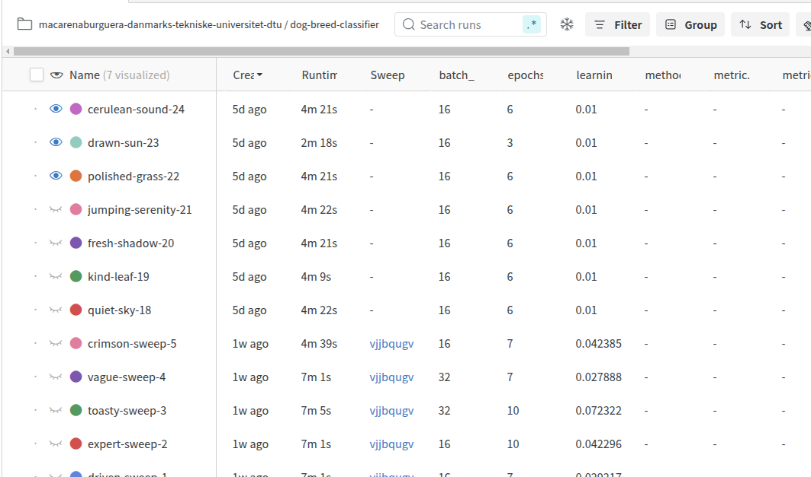
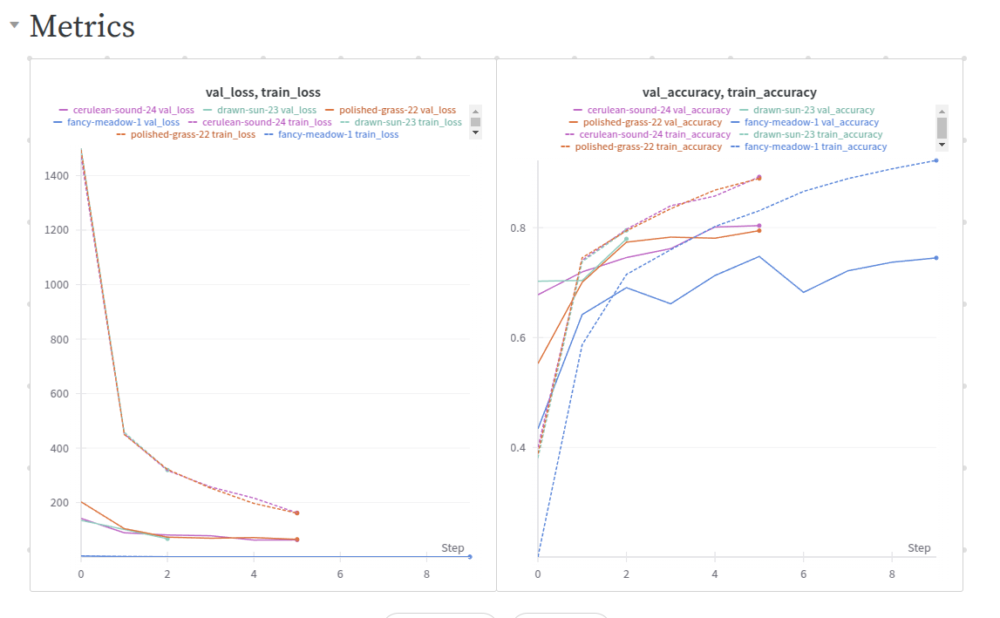
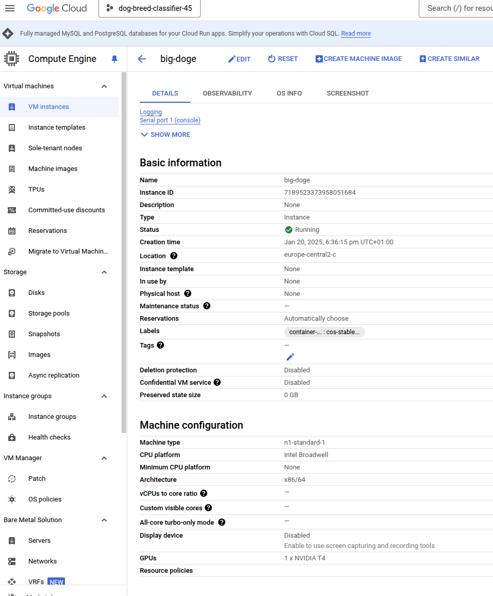
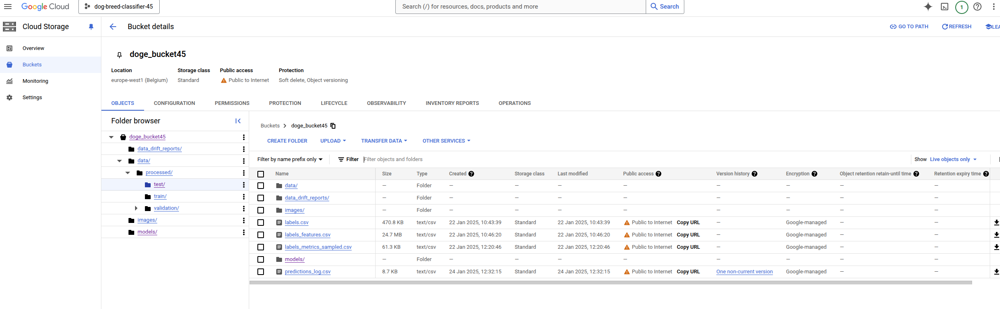
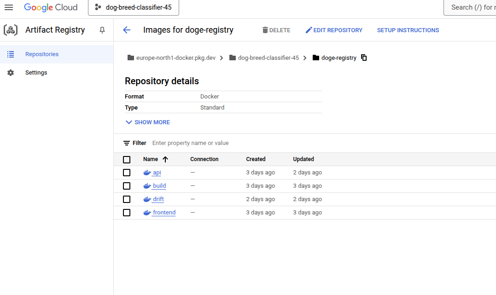
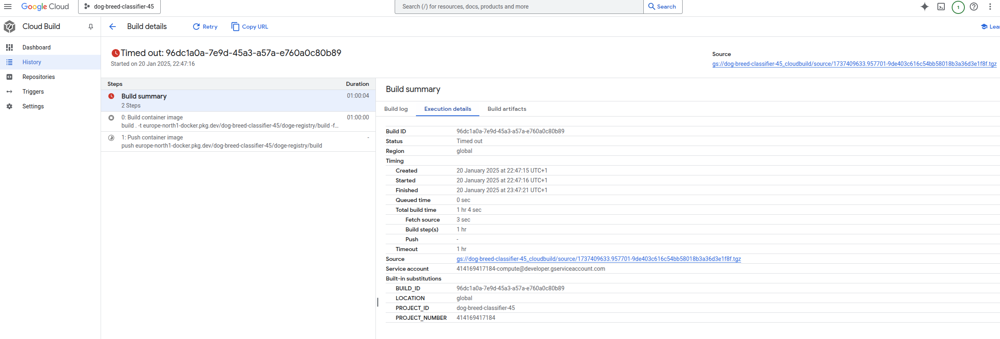
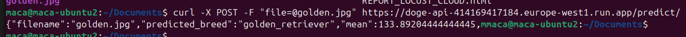
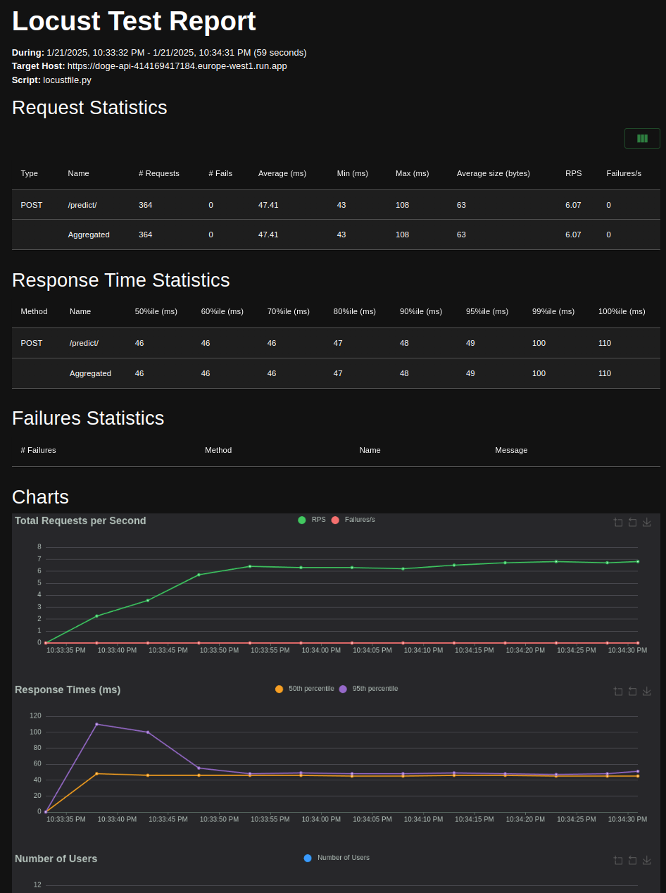
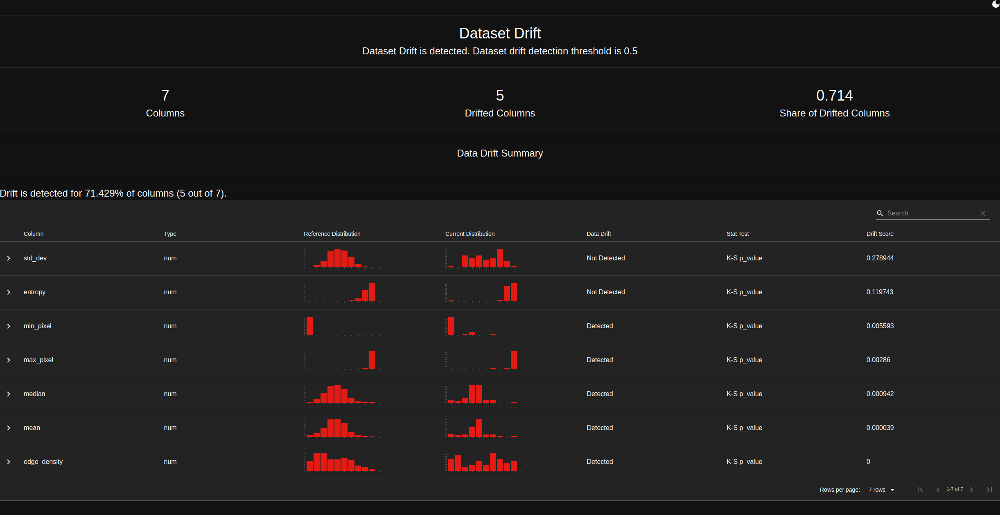
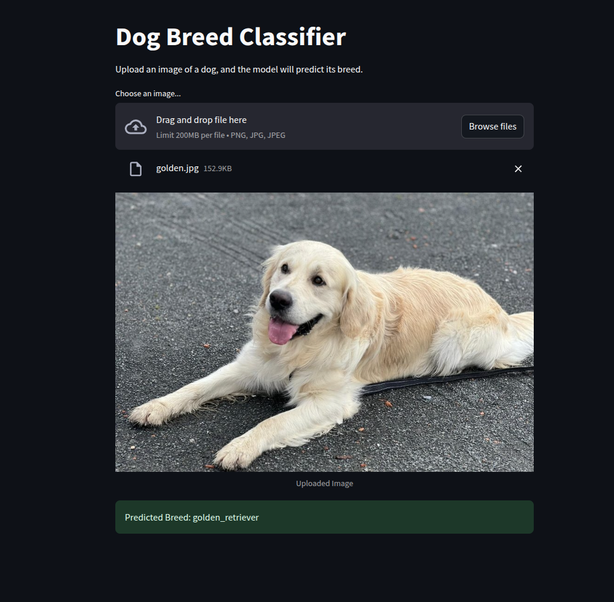

# Exam template for 02476 Machine Learning Operations

This is the report template for the exam. Please only remove the text formatted as with three dashes in front and behind
like:

```--- question 1 fill here ---```

Where you instead should add your answers. Any other changes may have unwanted consequences when your report is
auto-generated at the end of the course. For questions where you are asked to include images, start by adding the image
to the `figures` subfolder (please only use `.png`, `.jpg` or `.jpeg`) and then add the following code in your answer:

```markdown

```

In addition to this markdown file, we also provide the `report.py` script that provides two utility functions:

Running:

```bash
python report.py html
```

Will generate a `.html` page of your report. After the deadline for answering this template, we will auto-scrape
everything in this `reports` folder and then use this utility to generate a `.html` page that will be your serve
as your final hand-in.

Running

```bash
python report.py check
```

Will check your answers in this template against the constraints listed for each question e.g. is your answer too
short, too long, or have you included an image when asked. For both functions to work you mustn't rename anything.
The script has two dependencies that can be installed with

```bash
pip install typer markdown
```

## Overall project checklist

The checklist is *exhaustive* which means that it includes everything that you could do on the project included in the
curriculum in this course. Therefore, we do not expect at all that you have checked all boxes at the end of the project.
The parenthesis at the end indicates what module the bullet point is related to. Please be honest in your answers, we
will check the repositories and the code to verify your answers.

### Week 1

* [X ] Create a git repository (M5)
* [X ] Make sure that all team members have write access to the GitHub repository (M5)
* [X ] Create a dedicated environment for you project to keep track of your packages (M2)
* [X ] Create the initial file structure using cookiecutter with an appropriate template (M6)
* [X ] Fill out the `data.py` file such that it downloads whatever data you need and preprocesses it (if necessary) (M6)
* [X ] Add a model to `model.py` and a training procedure to `train.py` and get that running (M6)
* [X ] Remember to fill out the `requirements.txt` and `requirements_dev.txt` file with whatever dependencies that you
    are using (M2+M6)
* [X ] Remember to comply with good coding practices (`pep8`) while doing the project (M7)
* [X ] Do a bit of code typing and remember to document essential parts of your code (M7)
* [X ] Setup version control for your data or part of your data (M8)
* [X ] Add command line interfaces and project commands to your code where it makes sense (M9)
* [X ] Construct one or multiple docker files for your code (M10)
* [X ] Build the docker files locally and make sure they work as intended (M10)
* [X ] Write one or multiple configurations files for your experiments (M11)
* [X ] Used Hydra to load the configurations and manage your hyperparameters (M11)
* [ ] Use profiling to optimize your code (M12)
* [X ] Use logging to log important events in your code (M14)
* [X ] Use Weights & Biases to log training progress and other important metrics/artifacts in your code (M14)
* [X ] Consider running a hyperparameter optimization sweep (M14)
* [X ] Use PyTorch-lightning (if applicable) to reduce the amount of boilerplate in your code (M15)

### Week 2

* [X ] Write unit tests related to the data part of your code (M16)
* [X ] Write unit tests related to model construction and or model training (M16)
* [X ] Calculate the code coverage (M16)
* [X ] Get some continuous integration running on the GitHub repository (M17)
* [X ] Add caching and multi-os/python/pytorch testing to your continuous integration (M17)
* [X ] Add a linting step to your continuous integration (M17)
* [X ] Add pre-commit hooks to your version control setup (M18)
* [X ] Add a continues workflow that triggers when data changes (M19)
* [X ] Add a continues workflow that triggers when changes to the model registry is made (M19)
* [X ] Create a data storage in GCP Bucket for your data and link this with your data version control setup (M21)
* [X ] Create a trigger workflow for automatically building your docker images (M21)
* [X ] Get your model training in GCP using either the Engine or Vertex AI (M21)
* [X ] Create a FastAPI application that can do inference using your model (M22)
* [X ] Deploy your model in GCP using either Functions or Run as the backend (M23)
* [X ] Write API tests for your application and setup continues integration for these (M24)
* [X ] Load test your application (M24)
* [ ] Create a more specialized ML-deployment API using either ONNX or BentoML, or both (M25)
* [X ] Create a frontend for your API (M26)

### Week 3

* [X ] Check how robust your model is towards data drifting (M27)
* [X ] Deploy to the cloud a drift detection API (M27)
* [ ] Instrument your API with a couple of system metrics (M28)
* [X ] Setup cloud monitoring of your instrumented application (M28)
* [X ] Create one or more alert systems in GCP to alert you if your app is not behaving correctly (M28)
* [ ] If applicable, optimize the performance of your data loading using distributed data loading (M29)
* [ ] If applicable, optimize the performance of your training pipeline by using distributed training (M30)
* [ ] Play around with quantization, compilation and pruning for you trained models to increase inference speed (M31)

### Extra

* [X ] Write some documentation for your application (M32)
* [X ] Publish the documentation to GitHub Pages (M32)
* [X ] Revisit your initial project description. Did the project turn out as you wanted?
* [ ] Create an architectural diagram over your MLOps pipeline
* [X ] Make sure all group members have an understanding about all parts of the project
* [X ] Uploaded all your code to GitHub

## Group information

### Question 1
> **Enter the group number you signed up on <learn.inside.dtu.dk>**
>
> Answer:

--- 45 ---

### Question 2
> **Enter the study number for each member in the group**
>
> Example:
>
> *s243296, s242965, s242962*
>
> Answer:

--- s249246, attila, matyas  ---

### Question 3
> **A requirement to the project is that you include a third-party package not covered in the course. What framework**
> **did you choose to work with and did it help you complete the project?**
>
> Recommended answer length: 100-200 words.
>
> Example:
> *We used the third-party framework ... in our project. We used functionality ... and functionality ... from the*
> *package to do ... and ... in our project*.
>
> Answer:

---
We used Albumentations in our project to perform advanced image augmentations and effectively extend the variability of the dataset. Additionally we used TIMM in our project to access a variety of pretrained models and well-known architectures, from which we finally selected Resnet as our base architecture.

This has allowed us to significally augment our dataset, generating from each training image two variants combining affine transformations (scaling,rotating, shear) with color/noise transformations (histogram equalization, noise addition, brightness/contrast variations). This package has made really easy the application of such advanced transforms, leading to a pretty varied dataset to which we have trained our models against.
 ---

## Coding environment

> In the following section we are interested in learning more about you local development environment. This includes
> how you managed dependencies, the structure of your code and how you managed code quality.

### Question 4

> **Explain how you managed dependencies in your project? Explain the process a new team member would have to go**
> **through to get an exact copy of your environment.**
>
> Recommended answer length: 100-200 words
>
> Example:
> *We used ... for managing our dependencies. The list of dependencies was auto-generated using ... . To get a*
> *complete copy of our development environment, one would have to run the following commands*
>
> Answer:

--- All the projects necessary dependencies for running the pipeline can be found in the requirements.txt, except the Pytorch which is device dependant.
This requirements.txt was autogenerated and updated periodically using pipreqs, by just running

pipreqs . --force

The usage of this package allows us to maintain a cleaner requirements.txt, with just the imported packages in our code files. Afterwards, pytorch is removed to avoid incompatibilities, as it strictly depends on the current hardware setup of the user.

Separatedly, a requirements_dev.txt has been periodically updated manually, with the required packages for testing or debugging that not always appear on the imports of the code files, hence they will be missing from the requirements.txt.

As explained in the main README.md file of our project, the reccommended way of installing is:

1. Create a conda environment, if desired.
2. Install pytorch according to the current hardware. For example: `pip install torch==2.2.0 torchvision==0.17.0 torchaudio==2.2.0 --index-url https://download.pytorch.org/whl/cu118`
3. Install everyting (including dev dependencies) by just intalling the package with `pip install -e .`
4. Otherwise, just execute `pip install -r requirements.txt`

 ---

### Question 5

> **We expect that you initialized your project using the cookiecutter template. Explain the overall structure of your**
> **code. What did you fill out? Did you deviate from the template in some way?**
>
> Recommended answer length: 100-200 words
>
> Example:
> *From the cookiecutter template we have filled out the ... , ... and ... folder. We have removed the ... folder*
> *because we did not use any ... in our project. We have added an ... folder that contains ... for running our*
> *experiments.*
>
> Answer:

---

We preserved most of the cookiecutter template, with some slight modifications. We deleted the notebooks folder, as we didn't use any notebook, and added two additional folders:

- /scripts: includes two bash scripts that may serve useful to run all the complete pipeline and another one that is used in the build dockerfile as entrypoint.
- /raw: this folder is not tracked, so it doesn't apear in the repository (same happens with data/ and models/) but if downloaded it contains the raw dataset. The data/ folder, on the other side, contains the preprocesed data.

Additionally, we include in our repository two dvc files: one for tracking the preprocessed data (data.dvc) and the models (models.dvc). These files are complemented with the .dvc folder, from which we just sync in github the config file.

The rest of the structure follows the provided template:

- /.github for workflow files
- /configs for storing different model setups, and parameter sweep configurations
- /dockerfiles for storing different dockerfiles
- /reports includes this report
- /src/dog_breed_classifier includes the source code for each step. We have not used either evaluate.py nor visualize.py, so we have deleted it.
- /tests for unit tests

 ---

### Question 6

> **Did you implement any rules for code quality and format? What about typing and documentation? Additionally,**
> **explain with your own words why these concepts matters in larger projects.**
>
> Recommended answer length: 100-200 words.
>
> Example:
> *We used ... for linting and ... for formatting. We also used ... for typing and ... for documentation. These*
> *concepts are important in larger projects because ... . For example, typing ...*
>
> Answer:

--- question 6 fill here

We used several approaches on this, automating different checks throughout the pipeline so that we would be "forced" to take care of this. Decided this approach as it is convenient and strict.

- Installed flake8 and added a first Github Actions task to be performed on every push that checks it.
- Integrated ruff as well in our pre-commit file, as it detects formatting style misalignments and actually corrects them before committing.

It is super important because it keeps the code readable and makes easier to identify issues. If each one followed their own style it would be very difficult to collaborate and understand each part.

---

## Version control

> In the following section we are interested in how version control was used in your project during development to
> corporate and increase the quality of your code.

### Question 7

> **How many tests did you implement and what are they testing in your code?**
>
> Recommended answer length: 50-100 words.
>
> Example:
> *In total we have implemented X tests. Primarily we are testing ... and ... as these the most critical parts of our*
> *application but also ... .*
>
> Answer:

---

- Three tests for the data processing code, checking that the images are preprocessed and split correctly, and with valid transformations.
- Five tests for the model architecture, checking its initialization, forward pass, reaction to invalid inputs, parameters and resnet loading. We focused here as it is the most difficult part to detect failures.
- Three tests for the train script, to verify its initialization, dataset loading and train loop.
- Two tests for the API, checking robustness against different inputs.

Additionally we implemented a performance test of the model, to ensure that inference takes a reasonable time.

---

### Question 8

> **What is the total code coverage (in percentage) of your code? If your code had a code coverage of 100% (or close**
> **to), would you still trust it to be error free? Explain you reasoning.**
>
> Recommended answer length: 100-200 words.
>
> Example:
> *The total code coverage of code is X%, which includes all our source code. We are far from 100% coverage of our **
> *code and even if we were then...*
>
> Answer:

---

The final coverage we have achieved is 61%, being quite far from the 100% mainly because we have two files where we have not implemented it: the frontend and the data_drift code, which is not crucial for the main pipeline. Without counting them, we have achieved pretty good coverages in the files we have treated, achieving a 67% in the API as the lower, and a 76% coverage in the train code.

Even though, 100% coverage does not ensure perfect performance, as this type of unit testing only allows to handle specific logic predictable cases: output validity, case handling, correctness of different inputs/outputs. There are a lot of types of failures and malfunctions that lay deeper inside the code and cannot be detected with this kind of testing.

---

### Question 9

> **Did you workflow include using branches and pull requests? If yes, explain how. If not, explain how branches and**
> **pull request can help improve version control.**
>
> Recommended answer length: 100-200 words.
>
> Example:
> *We made use of both branches and PRs in our project. In our group, each member had an branch that they worked on in*
> *addition to the main branch. To merge code we ...*
>
> Answer:

--- question 9 fill here

Yes, we used both. To be honest, we started with just the main branch, but as code started to get bigger we inmediately switched to another approach, where we would work on separate branches for development and do a pull request to the main branch just when we had a functional version of what we were doing at the moment. Additionally, it was be on this pull request where we performed the toughest, more exhaustive tests in github Actions (such as OS compatibility), to ensure that the merged version is perfectly usable at the moment.

---

### Question 10

> **Did you use DVC for managing data in your project? If yes, then how did it improve your project to have version**
> **control of your data. If no, explain a case where it would be beneficial to have version control of your data.**
>
> Recommended answer length: 100-200 words.
>
> Example:
> *We did make use of DVC in the following way: ... . In the end it helped us in ... for controlling ... part of our*
> *pipeline*
>
> Answer:

---

Yes, we used DVC to keep track of our pre-processed data and our model, even though later on we added wandb for model logging. We started using google Drive and then switched to a Cloud bucket, as it eased up working within the GCloud environment.

We had two separate dvc files: one for the data/processed folder, and another one for the models folder. In github we just keep track of these two folders and of the config file included in the .dvc folder, containing the most important configuration to be able to connect to the remote storage and download the desired files. This way, the user just has to `dvc pull` the desired data right after cloning the repo, without further need to setup manually other dvc configurations.

In practice, it helped us as we avoided wasting time and local storage space by downloading and running the data.py script every time we installed the repo, as we could just pull the processed data straightforwardly. It was also very useful for model tracking, as we would only push the good versions we tested, and this way with each pull we ensured we had the latest, best version.

---

### Question 11

> **Discuss you continuous integration setup. What kind of continuous integration are you running (unittesting,**
> **linting, etc.)? Do you test multiple operating systems, Python  version etc. Do you make use of caching? Feel free**
> **to insert a link to one of your GitHub actions workflow.**
>
> Recommended answer length: 200-300 words.
>
> Example:
> *We have organized our continuous integration into 3 separate files: one for doing ..., one for running ... testing*
> *and one for running ... . In particular for our ..., we used ... .An example of a triggered workflow can be seen*
> *here: <weblink>*
>
> Answer:

---

On the first place, we have two minor workflows aimed at checking basic functionality, that are conditionally run on every push action to the development branch.

The first one is the tests_data.yaml workflow, which checks that the DVC system is correctly setup in our repository and each new user can pull the data easily without failures. Specifically, this one is just triggered when there is a change in the data files (in the .dvc config or .dvc files), to avoid unnecessary checks.

The other one is the model_speed.yaml workflow, which rather than just performing a "speed check" it also verifies that the latest model can be synced from WANDB and run correctly within the speed limits. We added this check after adding wandb support to our code, as we wanted to verify that the wandb setup works. For this reason, we had to provide the wandb API key and model name as environment variables in the code loaded from Github Secrets, to avoid integrating this confidential information inside the code.

Then, we have our main, toughest workflow, tests.yaml, which is only executed on pull requests for the main branch. It first checks some linting with flake8, which is quite strict (at the end we decided to skip some code errors that we considered negligible), and if it succeeds, it verifies the whole pipeline in the main three operating systems: Mac OS, Windows and Linux, running all unit tests.

For ensuring that our workflow file would run on all operating systems, we implemented two key solutions:
- We first forced all the actions to use the Linux Bash as command line (Bash)
- We introduced a conditional to perform the pytorch installation depending on the system.

---

## Running code and tracking experiments

> In the following section we are interested in learning more about the experimental setup for running your code and
> especially the reproducibility of your experiments.

### Question 12

> **How did you configure experiments? Did you make use of config files? Explain with coding examples of how you would**
> **run a experiment.**
>
> Recommended answer length: 50-100 words.
>
> Example:
> *We used a simple argparser, that worked in the following way: Python  my_script.py --lr 1e-3 --batch_size 25*
>
> Answer:

---
We used a very simple approach, where we take advantage of both config files and wandb logging.

Our training script is able to run in three different modes:
- local, with no wandb connection
- wandb-run, logging both the parameters setup and the model to wandb.
- sweep, parameter sweep with wandb

This way, when someone wanted to run a "public" experiment, he just logged into wandb setting up his WANDB_API_KEY and our WANDB_MODEL_NAME, set up the YAML files (either config.yaml, or sweep.yaml) and executed the run with the desired argument. For example: `python src/dog_breed_classifier/train.py sweep`.
 ---

### Question 13

> **Reproducibility of experiments are important. Related to the last question, how did you secure that no information**
> **is lost when running experiments and that your experiments are reproducible?**
>
> Recommended answer length: 100-200 words.
>
> Example:
> *We made use of config files. Whenever an experiment is run the following happens: ... . To reproduce an experiment*
> *one would have to do ...*
>
> Answer:

---
As explained in the previous question, we took complete advantage of the wandb model registry to keep track of all our model iterations, versions and experiments. As literally all the experiments we wanted were logged there, in case we wanted to reproduce a specific version we would just:

- Go to our wandb project page
- By viewing the graphs and the logs, select which model we wanted to reproduce. For example, the one that has proven to get the highest accuracy with the lowest number of iterations.
- Check the model version and parameters.
- We could just download that version of the model, but if we want to reproduce that experiment, it is as easy as filling our configs/config.yaml file and execute a train run on our code, either locally (`local`) or with wandb logging as well (`wandb-run`).

---

### Question 14

> **Upload 1 to 3 screenshots that show the experiments that you have done in W&B (or another experiment tracking**
> **service of your choice). This may include loss graphs, logged images, hyperparameter sweeps etc. You can take**
> **inspiration from [this figure](figures/wandb.png). Explain what metrics you are tracking and why they are**
> **important.**
>
> Recommended answer length: 200-300 words + 1 to 3 screenshots.
>
> Example:
> *As seen in the first image when have tracked ... and ... which both inform us about ... in our experiments.*
> *As seen in the second image we are also tracking ... and ...*
>
> Answer:

---

As explained before, we have completely taken advantage of the wandb logging features. As can be seen in the figure, we have run different experiments varying basic hyperparameters during training: batch size, number of epochs, learning rate and model (we tested both resnet50 and resnet18).




We tracked both training and validation loss and accuracy, as well as runtime for contrasing efficiency. An example of these metrics from the last experiments can be seen in the following figure:



The image shows how our model is able to achieve pretty good results with quite few epochs of training, in most cases. It also shows how there is a pretty observable difference between train and validation metrics, showing a slight overfitting.

We contrasted consistently the difference in both loss and accuracy between both sets, discarding those iterations with a higher training performance
but a significant difference with respect to the validation dataset, trying to minimize the overfitting present in our models. For this reason we also started testing with a pretty low number of iterations, as we verified that for the best setups after the fifth iteration or so the model just overfits, with no further improvement in validation metrics.

 ---

### Question 15

> **Docker is an important tool for creating containerized applications. Explain how you used docker in your**
> **experiments/project? Include how you would run your docker images and include a link to one of your docker files.**
>
> Recommended answer length: 100-200 words.
>
> Example:
> *For our project we developed several images: one for training, inference and deployment. For example to run the*
> *training docker image: `docker run trainer:latest lr=1e-3 batch_size=64`. Link to docker file: <weblink>*
>
> Answer:

---

We used docker as a straightforward way to copy either our complete environment or rather some specific parts that don't need everything (eg the frontend), having the advantage that in the cases that you need to install torch it is self-contained in the base image, so there is no need to even search for your system requirements. Additionally, and most important, we used those different dockerfiles to deploy our application to gcloud, so that it runs there without even need for installation. This way, the application is completely usable without further need to even download things.

First, we built up our train.dockerfile image, which:
- copies the repository
- installs dependencies
- pulls the preprocessed data from the cloud
- trains a model (its entrypoint is the train script)
- pushes the model to wandb, providing detailed logs on that run

We also have an alternate version, build.dockerfile, which just builds the environment and has no specific entrypoint, it just logs into the Bash terminal.

Additionally, we developed a dockerfile for the API with the following setup:

- copy the API code and some essential files from the repo (dvc support)
- pulls the last version of the model and a mapping csv from tha /data folder that maps each breed's ID to its corresponding name (eg: 49=golden-retriever).
- leaves the API running in the port 8000 of the machine

We need to address this port while running this image:

`docker run -p 8080:8000 api:v1.0`

We tagged and uploaded this image to google cloud, so that our API is running there constantly.

The other important image we have is the frontend one, which just installs very basic requirements and runs the frontend. We programmed the frontend script to connect directly to the deployed API in gcloud. Later on, we also tagged and uploaded this frontend image to the Cloud, so it is running constantly there taking advantage of the previously deployed API. It can be checked [here](https://frontend-414169417184.europe-west1.run.app).

Additionally, we developed a dockerfile for being able to test online the possible data drifting issues our model could have through time. It checks the model via our deployed API and saves the data in a reports folder that is stored in the project's gcloud bucket.

 ---

### Question 16

> **When running into bugs while trying to run your experiments, how did you perform debugging? Additionally, did you**
> **try to profile your code or do you think it is already perfect?**
>
> Recommended answer length: 100-200 words.
>
> Example:
> *Debugging method was dependent on group member. Some just used ... and others used ... . We did a single profiling*
> *run of our main code at some point that showed ...*
>
> Answer:

---

We performed debugging with a quite basic approach, inserting "print" self-explainable statements on every action performed on the code. We could trace most bugs by inspecting them and adding some where necessary. Some members also took advantage of the built-in features in vscode, as they are super straightforward to use, using mainly breakpoints to get deeper into the areas of code where we suspected we had some bugs. We did not integrate any specific profiling additional tools into our codes due to lack of time, but we know it would be a very convenient way of optimizing the data generation script. Our approach proved to be sufficient in terms of coding, being able to identify where the code was getting stuck and the different values and formats of the variables involved in these situations.

---

## Working in the cloud

> In the following section we would like to know more about your experience when developing in the cloud.

### Question 17

> **List all the GCP services that you made use of in your project and shortly explain what each service does?**
>
> Recommended answer length: 50-200 words.
>
> Example:
> *We used the following two services: Engine and Bucket. Engine is used for... and Bucket is used for...*
>
> Answer:

--- question 17 fill here

After some testing, we have finally implemented correctly in our system the following services:

- Bucket: to serve as remote storage of both our processed data and last model (as a backup to wandb), integrated into our DVC system.
- Engine: we did some training runs on a VM instance of Engine, but for our models it proved to be sufficient to train locally in a laptop of one of the members of the team, which had a modest Nvidia GPU that proved enough.
- Cloud Run: here we have deployed our API and frontend images, that are running standalone there in the cloud.
- Monitoring: we set up some monitoring for our application and configured some basic alerts regarding workload. Haven't got many notifications, as this is not truly public.. but we left it there, just in case our fancy dog classifier goes viral.

 ---

### Question 18

> **The backbone of GCP is the Compute engine. Explained how you made use of this service and what type of VMs**
> **you used?**
>
> Recommended answer length: 100-200 words.
>
> Example:
> *We used the compute engine to run our ... . We used instances with the following hardware: ... and we started the*
> *using a custom container: ...*
>
> Answer:

--- question 18 fill here
As said before, in our case we did not use that much Engine, but still we created a VM instance with the purpose of training our model there, with wandb monitoring enabled to be able to see live what is happening in the machine without need for further interaction.

We created this machine, "big-doge", as shown in the image: we had to use europe-central2-c as zone, as the other suggested northern/central european zones were giving problems when trying to connect to a reasonable GPU. We equipped our machine with 25 Gb (plenty of space just in case we wanted to download various sources of data/models locally) and a Nvidia T4 GPU.



To install everything, we first built our train image locally, then pushed it to Cloud and inside this virtual machine we pulled it. So we did training there. However, this approach did not give us much benefit in terms of training time so at the end we just kept training locally and streaming results/logs into wandb.

 ---

### Question 19

> **Insert 1-2 images of your GCP bucket, such that we can see what data you have stored in it.**
> **You can take inspiration from [this figure](figures/bucket.png).**
>
> Answer:

--- question 19 fill here

The GCP bucket has proven super useful. We were a bit reluctant to integrate it because we were working fine at the beginning with GDrive, but we don't regret it. We started it as just our DVC storage medium (data/processed and models) but we also added/stored there additional useful data:
- the original dataset with its labels
- an extended version including key metrics, for data drifting analysis
- the breed mapping csv
- a csv for logging every prediction entering into the system, with some metrics calculated for further data drifting analysis
- the data drift reports folder
- a folder with all the images that are queried to the system



 ---

### Question 20

> **Upload 1-2 images of your GCP artifact registry, such that we can see the different docker images that you have**
> **stored. You can take inspiration from [this figure](figures/registry.png).**
>
> Answer:

--- question 20 fill here
Here are all the images we have uploaded to the registry, each with a different functionality:



 ---

### Question 21

> **Upload 1-2 images of your GCP cloud build history, so we can see the history of the images that have been build in**
> **your project. You can take inspiration from [this figure](figures/build.png).**
>
> Answer:

--- question 21 fill here

We wanted to automate the build-up for the training process, but as our files were pretty big it was building up very slowly, so at the end we built locally and pushed manually when we wanted. Here an example:



---

### Question 22

> **Did you manage to train your model in the cloud using either the Engine or Vertex AI? If yes, explain how you did**
> **it. If not, describe why.**
>
> Recommended answer length: 100-200 words.
>
> Example:
> *We managed to train our model in the cloud using the Engine. We did this by ... . The reason we choose the Engine*
> *was because ...*
>
> Answer:

--- question 22 fill here

Yes, as explained in one of the previous questions, we managed to do so, even though we didn't keep using it much because we didn't consider it worth it in our application. We chose the Engine because we found it pretty flexible, and as we had the docker images ready, it was easy to pull the train image down to our VM and trigger there the training. It was also useful because sometimes while experimenting we changed things on-the-fly, and we could do this thanks to using a complete VM environment. Sometimes we would inspect or check the parameters files before triggering the training, to be sure or to modify them before a run. But however, we ended up just training locally.

 ---

## Deployment

### Question 23

> **Did you manage to write an API for your model? If yes, explain how you did it and if you did anything special. If**
> **not, explain how you would do it.**
>
> Recommended answer length: 100-200 words.
>
> Example:
> *We did manage to write an API for our model. We used FastAPI to do this. We did this by ... . We also added ...*
> *to the API to make it more ...*
>
> Answer:

--- question 23 fill here

Yes, we wrote a small fastAPI-based API for our model, equipped it with some Prometheus metrics and some logging features for enabling us further data drifting inspection. It works as this:

1. Loads all the necessary data from the bucket: the model, the breed mapping csv and a prediction log, also in csv format. If this log doesn't exist, it creates it.
2. For each /predict request, it takes the image, verify its format, do the inference with the model and return the corresponding breed name.
3. After this basic inference, it saves several metrics from the prediction skills of the model (eg inference time), from other errors that could happen (using Prometheus) and also computes image-related metrics from the requested image: mean, std deviation and median of the pixels, minimum and maximum value, entropy and edge density. These metrics were also computed for the complete dataset, and are used to perform data drifting analysis.
4. Updates the log file and uploads it again to the bucket.

Our API runs by default on port 8000.

---

### Question 24

> **Did you manage to deploy your API, either in locally or cloud? If not, describe why. If yes, describe how and**
> **preferably how you invoke your deployed service?**
>
> Recommended answer length: 100-200 words.
>
> Example:
> *For deployment we wrapped our model into application using ... . We first tried locally serving the model, which*
> *worked. Afterwards we deployed it in the cloud, using ... . To invoke the service an user would call*
> *`curl -X POST -F "file=@file.json"<weburl>`*
>
> Answer:

--- question 24 fill here

Yes. We first tested locally, running our API in localhost:8000. We downloaded some random dogs photos from the internet and checked the API was working from the command line, asking for the /predict endpoint. For example, with an image we had of a golden retriever we would run:

`curl -X POST -F "file=@golden.jpg" http://0.0.0.0:8000/predict/`

We then deployed the API (just the API) to the cloud: we built the api docker image and pushed it to cloud run, so that we would had it running there. Then, we checked again with the command line, but instead of to localhost we used the cloud based URL:

`curl -X POST -F "file=@golden.jpg" https://doge-api-414169417184.europe-west1.run.app/predict/`

As can be seen, it returns the prediction, and now that we have finished with the development it returns as well image metrics. Originally it just returned the predicted breed.



It worked, so we continued.

 ---

### Question 25

> **Did you perform any unit testing and load testing of your API? If yes, explain how you did it and what results for**
> **the load testing did you get. If not, explain how you would do it.**
>
> Recommended answer length: 100-200 words.
>
> Example:
> *For unit testing we used ... and for load testing we used ... . The results of the load testing showed that ...*
> *before the service crashed.*
>
> Answer:

--- question 25 fill here

Yes, we implemented some basic unit testing on our API, as explained before in the unit testing questions. It covered basic aspects of the API, such as its ability to handle the input files, and verified the API returned valid predictions. This is a bit basic, so we further relied on cloud metrics inspection and alerts to get a better overall idea of how our application was working.

We also did some load testing with Locust, checking both our API running in local mode and our cloud-deployed API. The results locally were brilliant, but of course the cloud deployed API was substantially slower. Didn't test it until its last limit, but we performed a load test for one minute with a slight increase of requests through time and we got enough good results. The response time was constant (except for some peaks at the beginning) and pretty fast, as shown in the image (corresponding to the cloud load test).


---

### Question 26

> **Did you manage to implement monitoring of your deployed model? If yes, explain how it works. If not, explain how**
> **monitoring would help the longevity of your application.**
>
> Recommended answer length: 100-200 words.
>
> Example:
> *We did not manage to implement monitoring. We would like to have monitoring implemented such that over time we could*
> *measure ... and ... that would inform us about this ... behaviour of our application.*
>
> Answer:

--- question 26 fill here

Yes, we implemented some monitoring. The most basic approach we've implemented is the prediction log system we have mentioned on previous questions, enabling us to monitor data drifting which is a kind of monitoring that needs to be set up on purpose (as it is very dependant on the data type the system is using).

Aditionally we implemented some Prometheus metrics, but very basic ones: a log for the classification times, an error counter, a request counter and a file size log. We checked we could access these metrics online, by accessing the /metrics/ endpoint of the API. We would have liked to develop a nicer frontend for it, as it would help visualizing for example the histogram for response times... but we left the raw API as it is, as we did not consider it a priority and we had also access to Cloud Metrics.

In practice, we mainly used the Metrics section of Cloud Run to have an overview of how our API is behaving. We also set up an alert so that we could receive an email in case the model receives an unexpected amount of visits per second.

 ---

## Overall discussion of project

> In the following section we would like you to think about the general structure of your project.

### Question 27

> **How many credits did you end up using during the project and what service was most expensive? In general what do**
> **you think about working in the cloud?**
>
> Recommended answer length: 100-200 words.
>
> Example:
> *Group member 1 used ..., Group member 2 used ..., in total ... credits was spend during development. The service*
> *costing the most was ... due to ... . Working in the cloud was ...*
>
> Answer:

--- question 27 fill here ---

### Question 28

> **Did you implement anything extra in your project that is not covered by other questions? Maybe you implemented**
> **a frontend for your API, use extra version control features, a drift detection service, a kubernetes cluster etc.**
> **If yes, explain what you did and why.**
>
> Recommended answer length: 0-200 words.
>
> Example:
> *We implemented a frontend for our API. We did this because we wanted to show the user ... . The frontend was*
> *implemented using ...*
>
> Answer:

---

The data drifting policy has been directly integrated into our main API application, keeping a log of several image metrics and saving them into a csv stored in our bucket. We developed another script, data_drift.py, that takes this log and compares it with our original dataset, for which we have as well computed its image metrics. This script uses some of the evidently package utilities to compare statistically both samples and generate a report, as can be seen in the image.



We took with a grain of salt this detected drift, as at this moment both samples (reference and predictions) are not even comparable: we have been testing 20 images as much, and comparing to the complete dataset the scope is pretty limited. A good approach to improve the quality of this comparison would be to get a way bigger prediction set by scraping continuously the internet for dogs images and passing them to the API.

We implemented the frontend with streamlit, building a simple interface where each user can upload an image of a dog to predict its breed, and the frontend would show the response from the API in the form of breed name.



---

### Question 29

> **Include a figure that describes the overall architecture of your system and what services that you make use of.**
> **You can take inspiration from [this figure](figures/overview.png). Additionally, in your own words, explain the**
> **overall steps in figure.**
>
> Recommended answer length: 200-400 words
>
> Example:
>
> *The starting point of the diagram is our local setup, where we integrated ... and ... and ... into our code.*
> *Whenever we commit code and push to GitHub, it auto triggers ... and ... . From there the diagram shows ...*
>
> Answer:

--- question 29 fill here ---

### Question 30

> **Discuss the overall struggles of the project. Where did you spend most time and what did you do to overcome these**
> **challenges?**
>
> Recommended answer length: 200-400 words.
>
> Example:
> *The biggest challenges in the project was using ... tool to do ... . The reason for this was ...*
>
> Answer:

--- question 30 fill here ---

### Question 31

> **State the individual contributions of each team member. This is required information from DTU, because we need to**
> **make sure all members contributed actively to the project**
>
> Recommended answer length: 50-200 words.
>
> Example:
> *Student sXXXXXX was in charge of developing of setting up the initial cookie cutter project and developing of the*
> *docker containers for training our applications.*
> *Student sXXXXXX was in charge of training our models in the cloud and deploying them afterwards.*
> *All members contributed to code by...*
>
> Answer:

--- question 31 fill here ---
